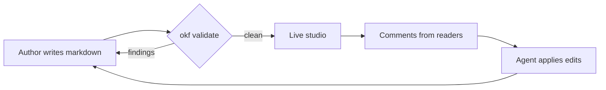
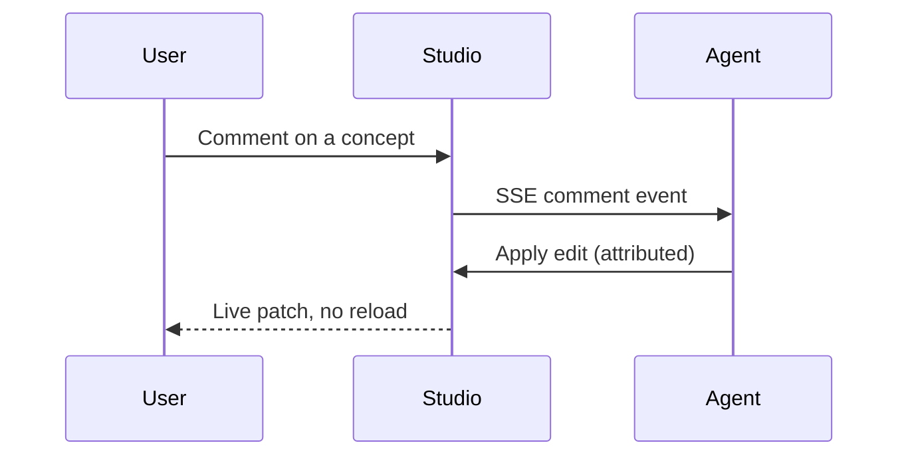

# Rendering & Feature Showcase

This page exists to be looked at. Everything okf-loom can render lives
below, and because you are (probably) viewing it in the **live studio**,
everything above this line — the type band, aliases subtitle, entity
chips, typed relations, provenance, and citations — came from the
frontmatter, not the body.

> **Try this while you read:** select any sentence on this page and a
> *Comment* button appears. The graph icon in the top bar shows how this
> page connects to the rest of the bundle.

## Text and structure

Standard Markdown works the way you expect: **bold**, *italic*,
`inline code`, and [internal links](/reference/cli.md) that get hover
previews — rest your pointer on that link. External links
[open in a new tab](https://example.com).

1. Ordered lists
2. With nesting
   - Unordered children
   - As deep as you need
3. And back out again

## Tables

| Feature | Where it renders | Degrades to |
| --- | --- | --- |
| Mermaid diagrams | This page, below | Raw diagram source |
| KaTeX math | This page, below | Raw LaTeX |
| Syntax highlighting | Every fenced block | Plain monospace |
| Hover previews | Internal links | Normal links |
| Live comments | Any selected text | Read-only view |

## Diagrams (Mermaid)

Flowcharts render from a fenced ` ```mermaid ` block, loaded lazily from
a pinned CDN build only when a page needs it:



Sequence diagrams too:



## Math (KaTeX)

A fenced ` ```math ` block renders display math:

```math
\operatorname{rank}(c) = \alpha \cdot \frac{\deg(c)}{\max_i \deg(i)} + (1 - \alpha) \cdot \sum_{t \in \text{tags}(c)} w_t
```

## Code with syntax highlighting

Python:

```python
from pathlib import Path

def concepts(bundle_root: Path) -> list[Path]:
    """Every concept is just a markdown file with frontmatter."""
    return sorted(
        p for p in bundle_root.rglob("*.md")
        if p.name not in {"index.md", "log.md"}
    )
```

JavaScript:

```javascript
// The graph consumes live SSE events — no reload needed.
window.okfLoomLive.on("graph", () => refreshGraphFromServer());
```

YAML (the shape of this very page's frontmatter):

```yaml
type: Demo
title: Rendering & Feature Showcase
tags: [demo, showcase, rendering]
timestamp: "2026-07-02T00:00:00Z"
relations:
  - type: references
    target: /reference/cli.md
```

## Blockquotes

> Documentation isn't done when there's nothing left to add.
> It's done when a reader can act without asking anyone.
>
> — every good docs team, eventually [diataxis]

## Governed keys on display

Scroll back to the top of this page and match what you see against the
frontmatter source (hit **Source** in the studio bar):

- **Aliases** render as the subtitle line under the title.
- **Entities** (Mermaid, KaTeX, highlight.js) render as chips with kind
  labels.
- **Relations** render as typed chips in the header *and* as labelled,
  colour-coded edges on the graph — open the graph view (top bar) and
  hover this node's edges.
- **Provenance** and **citations** get their own sections below the body.

## Live features to poke at

- **Search everything** with the *Commands* button in the studio bar (or
  `Ctrl+K` / `⌘K`).
- **Watch it update live**: edit this file on disk and the page patches
  in place — scroll position, selection, and drafts survive.
- **The graph is alive too**: add a concept file and watch it fade into
  the canvas with a "Graph updated" chip.
- **Path tracing**: on the graph, click one node then shift-click
  another to light up the chain between them.
