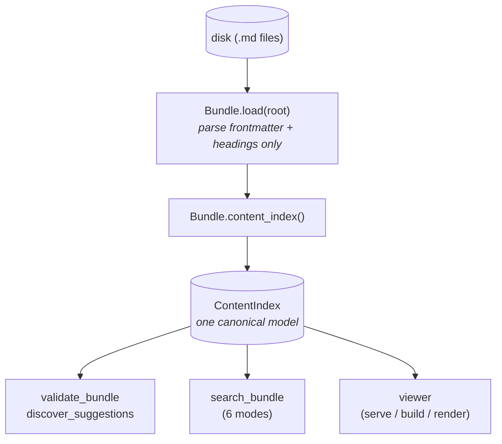

# okf-loom architecture

This essay explains the *rationale* behind okf-loom's shape. It is
the why, not the what: the neutral module-by-module walkthrough lives in
the deep [`/reference/architecture.md`](/reference/architecture.md), and
the per-command surface lives in
[cli.md](/reference/cli.md). Read this when you have used okf-loom
and are wondering why it is organised the way it is.

okf-loom mirrors the format's philosophy: it is **permissive** (load
never hard-fails on soft issues), **layered** (a cheap core with
optional extras), and **single-source-of-truth** (one canonical model
every consumer reads). Those three properties fall out of a small
number of deliberate structural choices, which this essay walks through.

# The founding lesson: one canonical model

The single most important idea in okf-loom is borrowed from Quartz
(see [`/explanation/research.md`](/explanation/research.md) §1): **one
canonical content index feeds many features.** Do not build a separate
index per consumer; emit one graph-plus-document model and let every
consumer read it.

In okf-loom that model is the `ContentIndex`. It is computed lazily
from the loaded `Bundle` and memoised on the bundle instance, so it is
built once and reused by everything that needs it.

Three properties fall out of this:

1. **Cheap to load.** `Bundle.load` parses frontmatter and headings; it
   does not build the graph or the content index. Those are computed on
   first call and memoised. A thousand-concept bundle loads in well
   under a second.
2. **No second index for the viewer.** Search, graph, listings, and the
   viewer all read the same in-memory object. There is never a drift
   bug where the viewer shows one graph and search assumes another.
3. **Mutations are round-trip.** Every writer goes through
   `parse_document → modify → serialize_document`, so unknown
   frontmatter keys and key order survive editing. The model and the
   file never disagree.

The reason this matters is drift. In a system with a search index, a
graph cache, and a render cache, each one is a chance for the user to
see stale data after a change. Collapsing all of them onto one model
removes an entire class of bugs by construction.

# One model, three render targets

The viewer does not have one shape; it has three, all driven by the
same canonical `ContentIndex`. This is the Quartz lesson applied to the
deployment shapes OKF wants to support — portability, interactivity,
embedding in a harness, and `file://`-openable artefacts.

| Target | Command | When it is the right choice |
|---|---|---|
| Live HTTP server | `scripts/okf-loom serve <bundle>` | The authoring loop. Watches files; live reload; harness embedding points a browser at the URL. |
| Multi-file static site | `scripts/okf-loom build --target {spa,static}` | A published reading experience (`spa`) or server-rendered, JS-optional, printable, SEO-friendly HTML (`static`). |
| Self-contained single file | `scripts/okf-loom render <bundle>` (or `build --target single-file`) | One portable HTML — email it, `file://`-open it, attach it to a ticket. Embeds the bundle as JSON. |

The same model, three projections. The deep comparison of these
patterns (and why each one earns its place) is in
[`/explanation/research.md`](/explanation/research.md) §15; the recipes for
the build targets are in [Build a static site](/how-to/build_static_site.md)
and the embedding shape is in [Embed the viewer in an agent
harness](/how-to/embed_in_harness.md).

> The single-file target is intentionally *one export option*, not the
> only viewer. It re-encodes the whole bundle into one file, which is
> great for sharing and bad for large bundles. Treating it as the sole
> surface would have made okf-loom useless past a few hundred
> concepts.

# Why the modules have their shapes

okf-loom is a flat set of focused modules rather than a framework.
Each one owns one concern and exposes it through a small, stable
function surface. The module map lives in
[`/reference/architecture.md`](/reference/architecture.md); the *why*
for each is below.

## The parse / model core

`parse.py` and `model.py` are the floor everything stands on. Parsing
is deliberately *lazy and forgiving*: frontmatter is parsed with
`yaml.safe_load`, links are extracted in both forms plus wikilinks, and
nothing in the load path raises on a soft issue. A concept with a
broken link, a missing description, or an unknown type still loads; it
just accumulates warnings from the validator.

This is a direct reflection of SPEC §9 — conformance is the three hard
rules, and everything else is guidance. A loader that rejected soft
issues would be a stricter gate than the spec itself imposes, which
would defeat the format's "never reject knowledge" posture.

## Validate: the conformance oracle

`validate.py` is shaped as an oracle that returns a structured report,
not a linter that exits. Findings split into `errors` (the SPEC §9 hard
rules), `warnings`, and `info`, and the same report is consumed by the
CLI (`scripts/okf-loom validate`, with `--strict` for CI), by the live studio (which
validates before every agent write so an unparseable file is never
persisted), and by the discovery pass (which re-surfaces broken links).

Validation profiles (`spec` / `producer` / `loose`) remap severities so
one validator serves a spec reader, a producer-side CI, and a migration
aid without changing the wire format. See
[cli.md](/reference/cli.md#validate) for the flags.

## Discover and plan: the gap-finders

`discover.py` and `plan.py` exist because a graph of plain links will
always have gaps, and the agent's job is to close them. Discovery emits
structured *suggestions* (rule, severity, message, target concept);
planning turns those suggestions (plus stale indexes and unmirrored
typed relations) into a *reviewable, executable action envelope*.

The split between the two is deliberate. Discovery is cheap and runs
over the whole bundle; planning is the layer that decides which
suggestions are mechanical (carry a runnable `argv`) and which need an
agent judgement (carry an `argv_template` with placeholders, a
confidence score, and an instruction). Both can be scoped to a single
concept and its neighbours, which is what makes per-change enrichment
fast — see [Discover and fix gaps](/how-to/discover_and_fix_gaps.md).

## Update: the round-trip-safe mutator

`update.py` is where the "mutations are round-trip" property is
enforced. Every op kind (`add_link`, `add_tag`, `set_frontmatter`,
`add_relation`, `append_body_section`, …) goes through the same
`parse_document → modify → serialize_document` pipeline, so frontmatter
key order and unknown keys survive. All writes are atomic (tmp +
rename), and the ops are idempotent — re-applying the same plan reports
`applied:0, skipped:N` with reasons.

In the live studio, `update.apply_plan` accepts `studio` / `actor` /
`origin` / `group_id` and threads them through every op, so a multi-op
pass is one group-undoable unit. That threading is what makes the
change list exact and undo complete.

## The viewer and its overrides

The viewer is a thin server-rendered HTML layer over `ContentIndex`,
with five override surfaces that let a bundle customise rendering
without forking: template overrides, static-asset overrides, a type
palette, a viewer config file, and a `ViewerPlugin` hook. Crucially,
the plugin hook is gated behind a **two-layer active-code gate** — a
bundle must declare `viewer.allow_active_code: true` *and* the operator
must pass `--allow-active-code` — because a plugin runs code in the
user's browser, and a downloaded bundle should never silently do that.

This is okf-loom's distinction between *data safety* (always on,
invisible) and *active code* (opt-in, explicit). Editing, saving, and
watching are never behind the active-code gate; running a bundle's
JavaScript always is.

## The studio: the collaboration layer

`studio.py` and `watch.py` are the live layer that turns `scripts/okf-loom serve`
into a live collaborative studio. The studio's defining structural
choice is the **single internal write funnel**: every concept write —
from a CLI mutator, from `apply_plan`, from `POST /__apply`, from
`POST /__undo` — goes through one function, `Studio.save_concept`. That
is what makes every write attributed, undoable, and visible on the
change list with no duplicated bookkeeping between the CLI and HTTP
paths.

The full rationale for the studio's shape — comment-driven directing,
no review gate, all-on defaults, the separate archive track, the trust
model — is its own essay in
[live_studio_design.md](live_studio_design.md).

# Why flat modules instead of a framework

A recurring design choice is that okf-loom is a flat checkout of
focused modules rather than an opinionated framework you subclass. The
reasons are practical:

- **Every module is independently importable.** You can `from
  okf_loom.validate import validate_bundle` without dragging in the
  viewer, the server, or the studio. A CI runner, a meta-agent's
  subprocess, and an air-gapped notebook all import only what they
  need.
- **There is no hidden global state.** The content index is memoised on
  the `Bundle` instance and released when it is garbage-collected;
  `Bundle.invalidate()` resets the caches. A long-running server that
  reloads bundles does not accumulate stale state.
- **Extension points are explicit, not magical.** Five override
  surfaces for the viewer; a `SearchBackend` Protocol for search; a
  capability registry for optional format extensions; a module-level
  `_RULES` dict for discovery rules. Adding behaviour means adding a
  function and registering it, not subclassing a base.

The cost of this choice is that there is no "plugin lifecycle" with
fancy hooks; if you want rich server-side behaviour you wire it into
your own code by checking `resolved.is_active("...")` on the capability
registry. okf-loom judges that a fair trade for staying
harness-agnostic and free of magic.

# Forward compatibility as an architectural property

The last architectural choice worth naming is that **forward
compatibility is structural, not bolted on.** Four mechanisms carry it:

1. **Spec-version tracking.** A single `SPEC_VERSION` constant; a
   bundle's declared `okf_version` is read on load and a mismatch
   produces a warning and best-effort consumption, never a hard failure
   (SPEC §11 mandate).
2. **Capability registry.** Optional behaviours live behind named
   capabilities (`okf.cap.typed_relations`, `okf.cap.entities`, …) that
   are *recognised-if-present, never required*. A bundle opts in by
   using the governed keys. See
   [capabilities.md](/reference/capabilities.md).
3. **Migration hooks.** `scripts/okf-loom upgrade --check` / `--apply` runs
   idempotent transformers reusing the same parse-modify-serialize
   pipeline. No migrations are defined for v0.1 because it is the
   baseline.
4. **Marker-safe auto-update.** `index.md` regeneration never destroys
   hand-authored content — it skips hand-authored files, rewrites only
   inside `<!-- okf:generated:index begin/end -->` markers, or replaces
   files that declare `generated: true`. `log.md` is always append-only.

The unifying principle is the SPEC §2 round-trip rule: producers may
add any keys; consumers must preserve them. The architecture is shaped
so that okf-loom is always a *consumer that adds value* (validation,
search, rendering, collaboration) and never a *producer that strips
information*. That is what lets the format and okf-loom evolve
independently.

# See also

* [Build a static site](/how-to/build_static_site.md) — when and how to
  use each build target.
* [Embed the viewer in an agent harness](/how-to/embed_in_harness.md) —
  the three integration shapes (CLI, library, long-running server).
* [Discover and fix gaps](/how-to/discover_and_fix_gaps.md) — where the
  discover → plan → update loop lives.
* [CLI command reference](/reference/cli.md) — every command and flag.
* [Capability registry](/reference/capabilities.md) — the forward-compat
  catalogue.
* [Why the live studio exists](live_studio_design.md) — the rationale
  for the studio layer on top of this architecture.
* [`/reference/architecture.md`](/reference/architecture.md) — the deep
  module-by-module walkthrough this essay summarises.
* [`/explanation/research.md`](/explanation/research.md) — the comparative
  survey (Quartz, Obsidian, MkDocs, …) that produced the "one content
  index" lesson.

Return to [Explanation](/explanation/index.md).
