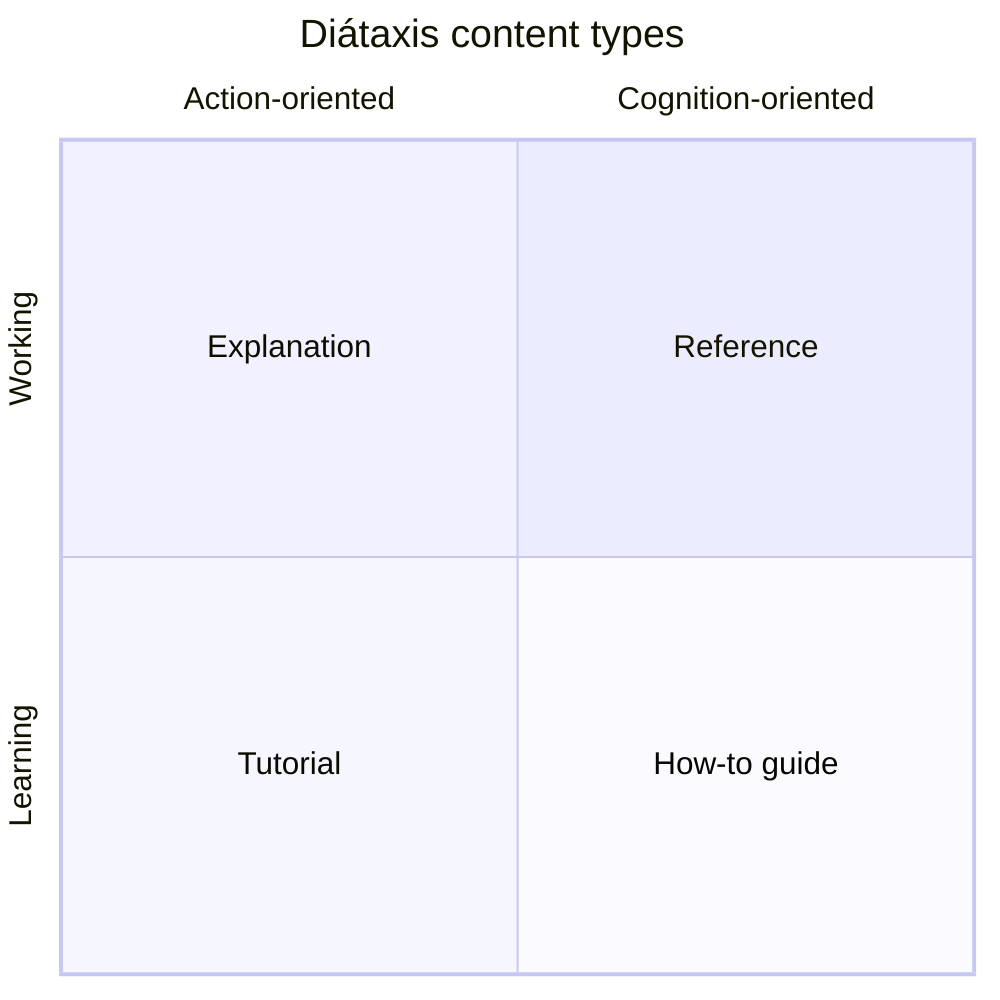

# Why this bundle uses Diátaxis

This bundle is organised by [Diátaxis](https://diataxis.fr/), a
documentation framework that sorts content by *purpose* rather than by
topic. This essay explains why this bundle adopted it, what the four
content types are, why mixing them in a single file confuses readers,
and how the framework maps cleanly onto OKF's `type:` frontmatter key.

Diátaxis is the source framework; the authoritative explanation lives
at <https://diataxis.fr/>. The comparative notes that informed this
bundle's adoption are in [`/explanation/research.md`](/explanation/research.md)
§13.

# The problem Diátaxis solves

Documentation fails in a familiar way: a single page tries to teach a
beginner, guide a practitioner, describe a mechanism, and argue a
design choice all at once. The beginner drowns in the reference; the
practitioner cannot find the recipe for the task at hand; the reader
who wants the *why* is buried under the *how*. The page serves no
posture well because it is trying to serve all of them.

Diátaxis observes that documentation readers are really in one of four
postures, and that each posture asks a different question and wants a
different kind of answer. The cure is to stop writing one document for
all four and start writing one document *per posture*, then make it
obvious which is which.

# The four content types and their postures

Diátaxis names four content types. Each one pairs a reader posture
with a promise the author makes to that reader.

| Type | Reader posture | Question | Promise the author makes |
|---|---|---|---|
| **Tutorial** | Learning | *How do I learn this?* | Takes a beginner by the hand; the reader reproduces every step and arrives at a working result. |
| **How-to guide** | Doing | *How do I do this one task?* | Solves a specific real-world goal; assumes the reader knows the basics and wants a recipe. |
| **Reference** | Finding | *What exactly does the machinery do?* | Describes the machinery neutrally; no steps, no opinion, no why. |
| **Explanation** | Understanding | *Why is it shaped this way?* | Clarifies the choices, the constraints, the alternatives; discussion, not direction. |

The two axes underneath that table matter as much as the cells. The
top row (Tutorial, How-to) is *action-oriented* — the reader is trying
to do something. The bottom row (Reference, Explanation) is
*cognition-oriented* — the reader is trying to know something. The
left column (Tutorial, Reference) is about the *tool as it is*; the
right column (How-to, Explanation) is about the *reader's work and
choices*.

This is the canonical Diátaxis grid; see
<https://diataxis.fr/> for the full treatment.

# How this bundle maps the four types

This bundle adopts Diátaxis by making the framework's four content
types the four subdirectories of the bundle — and, crucially, by using
each type as the OKF `type:` frontmatter value of the concepts inside
it. The Diátaxis type and the OKF type are the same field.

| Diátaxis type | This bundle's directory | OKF `type:` value |
|---|---|---|
| Tutorial | `tutorials/` | `type: Tutorial` |
| How-to guide | `how-to/` | `type: How-to` |
| Reference | `reference/` | `type: Reference` |
| Explanation | `explanation/` | `type: Explanation` |

Each directory has an `index.md` that lists its concepts, and the
bundle's root `index.md` frames the four quadrants for a reader
arriving at the top. A reader who lands on any concept can read its
`type:` and immediately know what posture the page is written for.

This is more than a filing scheme. The `type:` value is a **promise**
the author makes about the page's shape:

- A `Tutorial` *will* walk a beginner through runnable steps. If it
  assumes prior knowledge, it is miscategorised.
- A `How-to` *will* solve one real-world goal and assume the basics. If
  it stops to teach, it has drifted into Tutorial.
- A `Reference` *will* describe the machinery neutrally. If it argues
  a design choice, that argument belongs in Explanation; if it gives
  steps, those belong in How-to.
- An `Explanation` *will* discuss the why and compare alternatives. If
  it starts listing steps, those belong in How-to.

# Why mixing the types confuses readers

The reason the framework is strict about separation is that the
postures are mutually exclusive in the moment. A reader in the middle
of a task (How-to posture) is not also learning the basics (Tutorial
posture); a reader looking up a flag (Reference posture) is not also
absorbing a design argument (Explanation posture). When a single page
tries to serve two postures, it serves both badly.

Consider a `validate` command page. The Reference version is a table of
flags and exit codes. The How-to version is "Validate a bundle in CI" —
a recipe that picks the right flags for a CI pipeline. The Explanation
version is "Why there are three validation profiles" — an argument
about audiences. All three are about `validate`; none of them should be
the same document. A reader who wants the flag table does not want the
argument; a reader who wants the argument does not want the recipe; a
reader who wants the recipe does not want either.

This bundle enforces the split structurally. The same `validate`
command appears in:

- [Validate a bundle in CI](/how-to/validate_in_ci.md) — the recipe.
- [CLI command reference](/reference/cli.md#validate) — the neutral
  flag table.
- (And the design choice behind the profiles is argued here, in an
  Explanation, when relevant.)

Three postures, three pages, one topic. The reader picks the page that
matches their posture.

> Diátaxis's own guidance is blunt on this point: a document that mixes
> types is not a stronger document — it is a weaker one, because it
  fails every reader it tries to serve simultaneously.

# Why Diátaxis maps so cleanly onto OKF

The reason this bundle can adopt Diátaxis without a format change is
that OKF already declines to impose a type taxonomy (SPEC §1 non-goal)
while listing example `type` values (`BigQuery Table`, `Playbook`,
`Reference`, …). A documentation bundle that wants Diátaxis simply
*uses* the four type names as its `type:` values; the format treats
them like any other producer-defined string and okf-loom preserves
them round-trip.

This is the SPEC §2 round-trip rule in action: producers may add any
keys; consumers must preserve them. Diátaxis is not a special case to
okf-loom — it is one of many possible type vocabularies a bundle can
adopt. A data-catalog bundle would use domain types (`BigQuery Table`,
`Dataset`, `Metric`); a playbooks bundle would use `Playbook` and
`Runbook`; this documentation bundle uses the four Diátaxis types. None
of them requires a spec change or a capability declaration, because
`type` is a free-form string and okf-loom auto-colours the graph by
type hash regardless of vocabulary.

The capability registry even has a `okf.cap.diataxis_types` capability
for bundles that want okf-loom to *recognise* the four types and
validate their conventional sections (tutorials have steps; reference
has schema; explanation has no steps). That capability is
recognised-if-present and never required — consistent with
okf-loom's posture that type vocabularies are a bundle's choice, not a
spec mandate. See [capabilities.md](/reference/capabilities.md).

# How to read this bundle

With the framework in mind, the bundle's shape is self-explaining:

- **New to okf-loom?** Start in [Tutorials](/tutorials/index.md) and
  read top to bottom, reproducing each step.
- **Have a specific task?** Jump to [How-to guides](/how-to/index.md)
  and find the recipe.
- **Looking up a fact?** Open [Reference](/reference/index.md) and find
  the page.
- **Want the why?** Read [Explanation](/explanation/index.md) — you are
  in it right now.

The four postures are also cross-linked. A tutorial that uses the CLI
links to the CLI reference; a reference page links to the how-to that
exercises it; an explanation links to both the tutorial where the
choice manifests and the reference that describes the machinery. The
links are what let a reader change posture without losing their place.

# When Diátaxis is the wrong choice

This bundle is documentation, so Diátaxis fits. The framework is
explicitly a *documentation* taxonomy, not a domain taxonomy, and it
does not fit every bundle. A data catalog's types are domain-specific
(`BigQuery Table`, `API Endpoint`); a playbooks bundle's types are
operational (`Runbook`, `Playbook`); a knowledge graph's types are the
entities themselves. Forcing Diátaxis onto those bundles would be a
category error — it would impose a documentation vocabulary on content
that is not documentation.

okf-loom's stance, reflected in [`/explanation/research.md`](/explanation/research.md)
§13, is that Diátaxis is a *strong recommended default for
doc-oriented bundles* and *irrelevant for domain catalogs*. This bundle
is a doc-oriented bundle, so it adopts the framework. A bundle that is
not should pick the type vocabulary that matches its domain — the
format and okf-loom support both equally.

# See also

* [Author your first bundle](/tutorials/first_bundle.md) — where the
  Tutorial posture shows up in practice.
* [Validate a bundle in CI](/how-to/validate_in_ci.md) — a How-to
  guide in its pure form.
* [CLI command reference](/reference/cli.md) — the Reference posture.
* [Frontmatter contract](/reference/frontmatter.md) — the `type:` key
  this framework uses as its vocabulary.
* [Capability registry](/reference/capabilities.md) — the
  `okf.cap.diataxis_types` capability, recognised-if-present.
* [Diátaxis](https://diataxis.fr/) — the source framework.
* [`/explanation/research.md`](/explanation/research.md) §13 — the
  comparative note that framed Diátaxis as an optional type taxonomy.

Return to [Explanation](/explanation/index.md).
