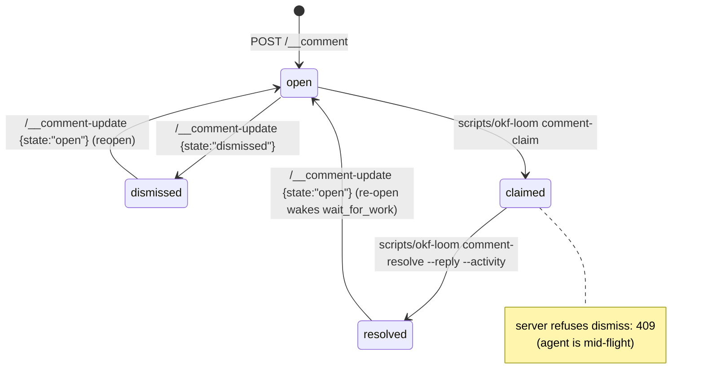

# Comment lifecycle and archive rules

A **comment** (also called a **directive**) is a user-authored ask
that lands in `<bundle>/.okf-loom/session/directives.jsonl`. Comments
drive the live studio's comment-driven development loop: the user
directs via comments, the agent consumes them via
[`scripts/okf-loom wait`](cli.md#wait), and the loop closes when the agent
resolves the comment.
See [index.md](/reference/index.md) for the rest of the reference quadrant.

This document describes the current okf-loom v1.0 state model.

# Two independent tracks

A comment carries two independent pieces of state:

| Track | Field | Values |
|---|---|---|
| **Lifecycle state** | `state` | `open` / `claimed` / `resolved` / `dismissed` |
| **Archive flag** | `archived` | `true` / `false` |

Archive is a **soft hide**, not a lifecycle state. Archiving a
resolved comment keeps it resolved; unarchiving restores the prior
visibility without flipping state. The two tracks never interact
except through the server-side archive gate (see below).

# Lifecycle states

| State | Meaning | Who sets it |
|---|---|---|
| `open` | New user comment; not yet picked up. Default on creation. | User (`POST /__comment`) or reopen. |
| `claimed` | Agent has picked it up and is working on it. Sets `claimed_by`. | Agent ([`scripts/okf-loom comment-claim`](cli.md#comment-claim)). |
| `resolved` | Agent completed the work and posted a reply + activity links. | Agent ([`scripts/okf-loom comment-resolve`](cli.md#comment-resolve)). Agent replies from [`comment-reply`](cli.md#comment-reply) are born `resolved`. |
| `dismissed` | User cancelled an unclaimed comment. | User (`POST /__comment-update {state:"dismissed"}`). |

## State diagram



The agent never dismisses; the agent resolves. The user never
claims or resolves; the user dismisses or reopens.

# Transitions and timestamps

Each comment carries two timestamps:

| Field | Mutability | When it changes |
|---|---|---|
| `ts` | Immutable | Set once at creation. |
| `updated_at` | Bumped on every transition | Claim, resolve, dismiss, reopen, archive, unarchive, reply, summary update, body edit. |

`scripts/okf-loom wait` treats a re-opened comment as fresh work even though its
`id` is unchanged: it tracks the latest `updated_at` (with a
compatibility fallback to `ts` for older records).

# Body edits (open/claimed only)

The comment author can amend the text of a not-yet-resolved comment in
place: `POST /__comment-update` with a non-empty `body`. The studio UI
shows an Edit button on user-authored, not-yet-resolved comments.

| Rule | Detail |
|---|---|
| Allowed states | `open` / `claimed` only. `409` "cannot edit a resolved/dismissed comment (reopen it first)" on `resolved`/`dismissed`. |
| Empty body | `400`. |
| `updated_at` | Bumped — an agent blocked in [`scripts/okf-loom wait`](cli.md#wait) re-receives the corrected ask as fresh work. |
| `request_summary` | Re-derived from the new body, so the collapsed preview tracks the edit. |

# The `summary` field

A short agent-authored blurb shown in the collapsed thread preview.

```bash
scripts/okf-loom comment-claim   <bundle> <id> --summary "adding depends_on + Order entity"
scripts/okf-loom comment-resolve <bundle> <id> --summary "done: link + entity added" \
                                --reply   "Done — added depends_on + Order entity" \
                                --activity 01JABED5K7,01JABED5K8
```

`summary` is separate from `reply` (the long-form resolution
message). The collapsed preview shows the actor prefix
(`You:` / `Agent:`), the body ellipsis, and the summary chip; the
user expands the thread to read the full reply.

# Threading (2-level cap)

A comment may carry a `parent_id` linking a reply to its parent.
The studio renders up to **2 levels of nesting**
(parent → reply → reply-to-reply); deeper nesting is hoisted to root.

| Property | Detail |
|---|---|
| `parent_id` | Set on the reply; the reply is anchored to the parent's concept. |
| 2-level cap | Parent → reply → reply-to-reply. Further replies hoist to root. |
| Anchor inheritance | A reply inherits the parent's `concept`. |

Use replies to ask the user a clarifying question on an existing
directive rather than opening a new top-level comment.

## Agent replies (`comment-reply`)

The agent-side channel is
[`scripts/okf-loom comment-reply`](cli.md#comment-reply). The reply is
posted under the thread **root** (replying to a reply hoists to the
root, matching the display cap) and never touches the parent's
lifecycle state — reply-without-resolve is the point. It is created
with `state=resolved` and `claimed_by=<actor>` (a statement, not an
ask), so [`wait --for comment`](cli.md#wait) never returns the agent
its own reply and the all-resolved archive gate stays satisfiable
without the agent resolving its own remarks. The user's answer — their
reply — wakes `wait` as new work.

# Archive rules

## Separate track

`archived` is a **boolean field**, not a lifecycle state. Archive
does not change `state`; it only flips the boolean the UI uses to
hide the thread.

| Operation | Effect on `state` | Effect on `archived` |
|---|---|---|
| Archive | unchanged | `true` |
| Unarchive | unchanged | `false` |

## Server-side rules

| Rule | Failure response |
|---|---|
| Archive only on the **root** comment of a thread. | `400` "archive is only available on the top-level comment of a thread". |
| Archive only when **every** comment in the thread (root + all replies) is `resolved`. | `409` with `unresolved_ids: [...]`. |
| Dismiss a `claimed` comment. | `409` "cannot dismiss a claimed comment". |

The UI disables the Archive button client-side with a tooltip until
the whole-thread-resolved gate is met; the server enforces the same
rule so a hand-crafted POST cannot bypass it.

## Auto-unarchive on reply

Replying to an archived thread **auto-unarchives the parent**. The
reply itself is never archived. Adding to a thread reopens it for
business; archive is a soft hide, not a closed state.

This is enforced in `Studio.post_comment`: when `parent_id` points
at an archived parent, the parent is unarchived before the reply is
appended.

## Compatibility normalisation

Some older records used `state == "archived"` as a lifecycle state
before archive became a separate track. On read, these are
normalised to `archived=true, state="open"` (best-effort
migration). The on-disk record is not rewritten; normalisation is
view-only.

# Reading comments

| Source | API |
|---|---|
| CLI | [`scripts/okf-loom comment-list <bundle>`](cli.md#comment-list) — filters `--state`, `--concept`. |
| HTTP | `GET /__comments` — see [http_routes.md](http_routes.md). |
| Library | `Studio.list_comments(state=…, concept=…)` / `Studio.get_comment(id)`. |

`directives.jsonl` is append-only: a transition appends a new full
record for the same `id`. Readers keep only the latest record per
id (last-write-wins).

# JSON shape of a comment record

A single record as returned by `GET /__comments` or
`scripts/okf-loom comment-list --format json`:

```json
{
  "id": "01JABED9K0",
  "ts": "2026-06-29T18:12:39Z",
  "updated_at": "2026-06-29T18:14:02Z",
  "concept": "tables/orders",
  "anchor": {"heading": "Schema", "snippet": "customer_id"},
  "actor": "user",
  "body": "Add a depends_on relation to customers.",
  "state": "resolved",
  "claimed_by": "agent",
  "resolved_activity": ["01JABED5K7", "01JABED5K8"],
  "reply": "Done — added depends_on + Order entity",
  "request_summary": "ask: add depends_on relation",
  "summary": "done: link + entity added",
  "detail": {"intent": "add_relation"},
  "archived": false,
  "parent_id": null
}
```

| Field | Type | Notes |
|---|---|---|
| `id` | string | ULID; sortable as a string. |
| `ts` | string (ISO 8601) | Immutable creation timestamp. |
| `updated_at` | string (ISO 8601) | Bumped on every transition. |
| `concept` | string | Concept id the comment is anchored to. |
| `anchor` | object | Heading/snippet for inline placement (may be `{}`). |
| `actor` | string | `user` (default) or `agent`. |
| `body` | string | The comment text. |
| `state` | string | `open` / `claimed` / `resolved` / `dismissed`. |
| `claimed_by` | string \| null | Set on claim; cleared on reopen. Agent replies born `resolved` set it at creation. |
| `resolved_activity` | list of strings | Change-list entry ids linked to the resolution (group undo). |
| `reply` | string \| null | Long-form resolution message (set on resolve). |
| `request_summary` | string \| null | Short blurb for the ASK — written by `comment-claim --summary`, auto-derived from the first line of `body` when absent. |
| `summary` | string \| null | Short blurb for the DONE — written by `comment-resolve --summary`. |
| `detail` | object | Free-form metadata (e.g. Quick Action intent). |
| `archived` | bool | Archive flag. Independent of `state`. |
| `parent_id` | string \| null | Parent comment id for a threaded reply. |

# Storage and rotation

| File | Location | Rotation |
|---|---|---|
| `directives.jsonl` | `<bundle>/.okf-loom/session/directives.jsonl` | 2 MiB active cap, 3 files kept. Comment spam cannot fill the disk. |
| `events.jsonl` | `<bundle>/.okf-loom/session/events.jsonl` | 8 MiB active cap (`studio.events_max_bytes`), 7 files kept (`studio.events_keep`). |
| `history/<hex>/<rev>.md` | `<bundle>/.okf-loom/session/history/` | Ring-capped; pruned entries surface as `404 snapshots_pruned` on undo. |

# Staleness recovery

A dropped agent process is auto-recovered by the watcher sweep:

| State | Reverted to | After |
|---|---|---|
| Agent presence (`editing`/`thinking`/`watching`) | `idle` | `studio.presence_ttl_seconds` (default `300`). |
| A `claimed` comment | `open` | `studio.claim_stale_seconds` (default `600`). |

No directive is orphaned if the agent crashes mid-task.

# Workflow

The canonical agent loop:

```bash
scripts/okf-loom wait           <bundle> --for comment     # foreground block-once
scripts/okf-loom comment-claim  <bundle> <id> --summary "…"
scripts/okf-loom comment-reply  <bundle> <id> --body "Did you mean X or Y?"  # only when the ask is ambiguous
scripts/okf-loom presence       <bundle> --state editing --focus tables/orders --message "linking 3 of 7 tables…"
# …mutators (link-add / entity-add / update) with --group-id PASS1…
scripts/okf-loom comment-resolve <bundle> <id> --reply "Done — …" \
       --activity 01JABED5K7,01JABED5K8 --summary "done: …"
```

The comment `wait` returns carries a `queue: {pending: N, ids: [...]}`
field — the other open comments still pending — so the agent sees
backlog depth without diffing `comment-list` between loop turns; the
one-work-item contract (block once, print one item, exit) is
unchanged.

See [/tutorials/author_with_agent.md](/tutorials/author_with_agent.md)
for the end-to-end walk-through and
[/how-to/archive_threads.md](/how-to/archive_threads.md) for the
archive/unarchive workflow.

# See also

- [index.md](/reference/index.md) — reference quadrant index.
- [cli.md](cli.md) — `wait`, `comment-claim`, `comment-reply`, `comment-resolve`, `comment-list`, `presence`, `token`.
- [http_routes.md](http_routes.md) — `/__comment`, `/__comment-update`, `/__comments`, `/__events`.
- [config_yaml.md](config_yaml.md) — `studio.presence_ttl_seconds`, `studio.claim_stale_seconds`, rotation caps.
- [/tutorials/author_with_agent.md](/tutorials/author_with_agent.md) — the agent loop tutorial.
- [/tutorials/live_studio_basics.md](/tutorials/live_studio_basics.md) — first studio session.
- [/how-to/archive_threads.md](/how-to/archive_threads.md) — archive/unarchive workflow.
- [/explanation/live_studio_design.md](/explanation/live_studio_design.md) — why archive is a separate track.
- `okf-loom/scripts/okf_loom/studio.py` — authoritative source (`post_comment`, `update_comment`, `resolve_comment`, `wait_for_work`).
