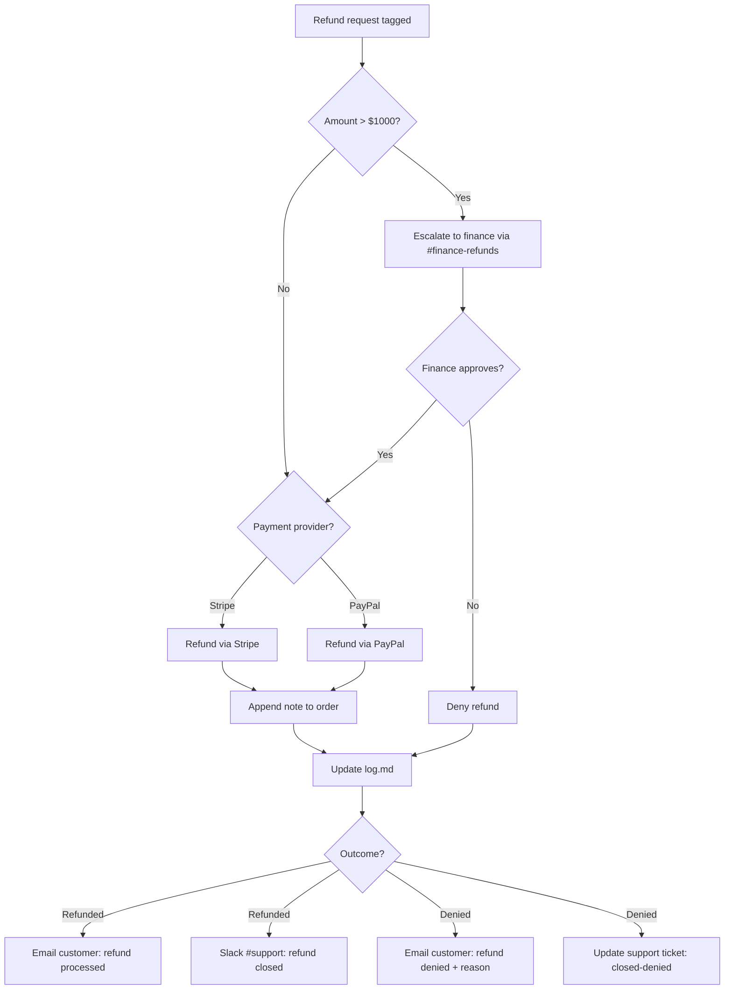

# Trigger

A refund request lands in the support queue and is tagged `refund-pending`.

| Field | Value |
|---|---|
| Severity | P2 (standard), P1 if > $1000 USD |
| SLA | Respond within 4 hours; resolve within 1 business day |
| Owner | Support team; escalate to finance above $1000 |
| Frequency | ~30/week average, spikes during outage windows |

# Context

Refunds touch three systems: the [orders table](/tables/orders.md), the
[customers table](/tables/customers.md), and the payment provider (Stripe or
PayPal, depending on the original charge). A refund that touches a subscription
also involves the [billing service](/services/checkout.md).

# Steps

1. Locate the order in the [orders table](/tables/orders.md) by id.
2. Confirm the customer via [customers](/tables/customers.md).
3. Issue the refund through the payments provider.
4. Append a note to the order; do not delete the row.



# Escalation: Refunds Over $1000

Refunds **over $1000 USD** require explicit finance approval before processing.

> **Warning:** Do not process a refund above $1000 without written approval
> from the finance team. Unauthorized large refunds are flagged for audit.

**Sample escalation message:**

```
@finance-refunds - refund approval needed

order_id:        ord_8f3a91c2
customer_id:     cus_4b7e (tier: Enterprise)
amount:          USD 742.00
original_charge: Stripe ch_3OqW...
reason:          Duplicate charge during 2026-06-27 checkout outage.
```

# Common Issues

- **PayPal refunds fail intermittently:** retry up to 3 times with 5-minute
  backoff; if still failing, escalate to the payments on-call.
- **Subscription refunds:** coordinate with the
  [billing service](/services/checkout.md); the subscription must be cancelled
  before the refund is issued.
- **Currency mismatch:** verify the refund is in the same
  [currency](/references/currencies.md) as the original charge.

# Post-Refund Checklist

- [ ] Order status updated to `refunded` in the [orders](/tables/orders.md) table
- [ ] Customer notified via the support ticket
- [ ] `log.md` entry appended with date, amount, and approver
- [ ] If subscription: confirm cancellation in the billing dashboard
